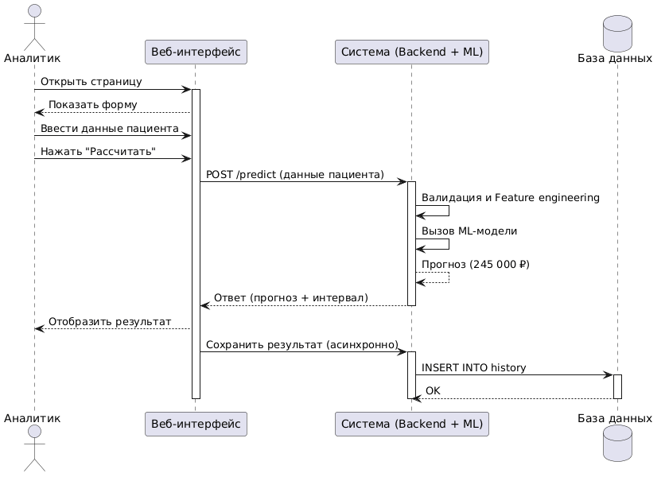
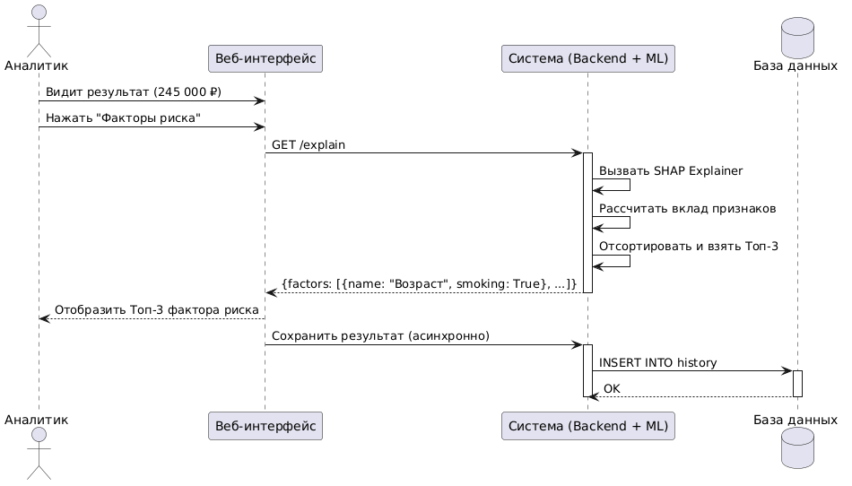
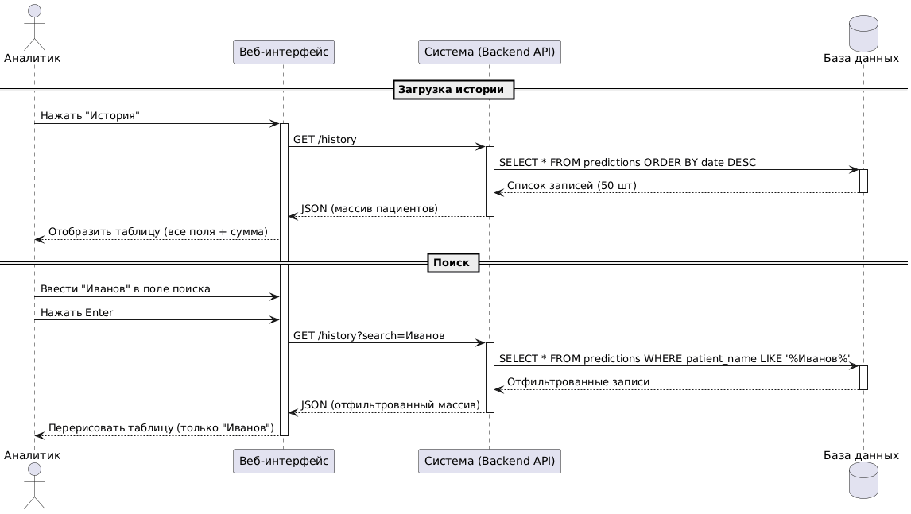
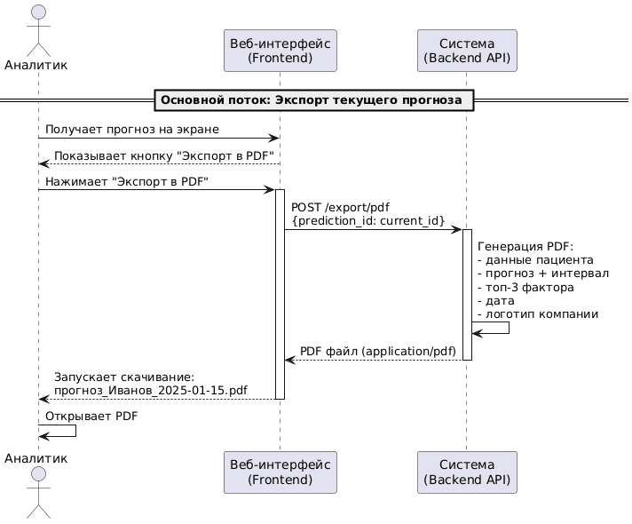
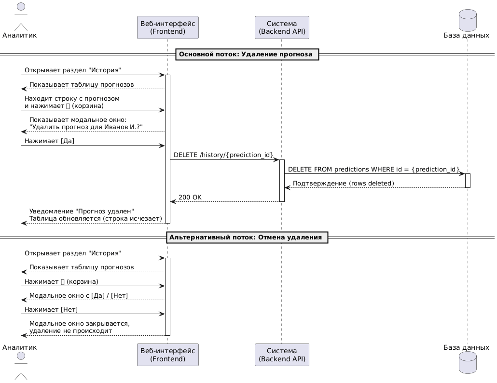
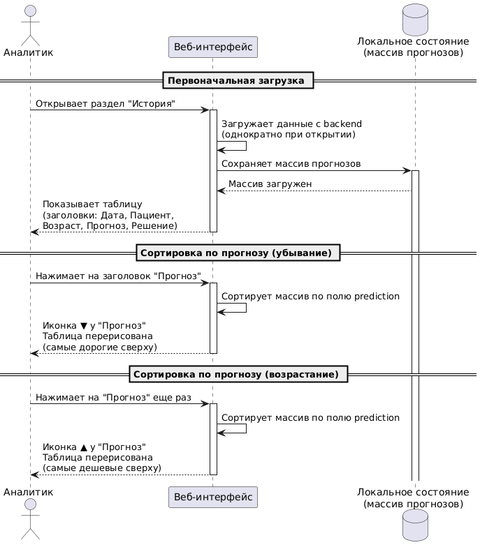

# medcost-prediction-app
Система прогнозирования годовых медицинских расходов пациента на основе табличных данных

## 📖 О проекте

**MedCost Prediction App** — это hi-fidelity прототип цифрового ML-продукта, который позволяет ввести данные пациента, получить прогноз ожидаемых медицинских расходов, сохранить расчёт, получить аналитику по факторам риска и посмотреть историю сохранённых прогнозов.

Проект ориентирован на сценарий работы **страхового аналитика**, которому нужно быстро и единообразно оценивать кейсы по данным пациента.

## 🧑‍💻 Команда проекта

- **Team Lead** - руководит проектом, определяет архитектуру, наводит на нужный путь и делает ревью. 
- **BA/PM** - готовит презентации, представляет проект на отчётных занятиях, отвечает на вопросы и получает обратную связь на защите проекта.
- **Data Scientist** - проводит аналитику данных, готовит датасет для ML, строит модели ML.
- **Backend** - разрабатывает бэкенд, отвечающий за ML-инференс, бизнес-логику и работу с БД.
- **Frontend** - разрабатывает интерфейс прототипа: формы ввода, отображение результатов и навигацию по приложению.
- **QA** - проводит тестирование прототипа, оценивает качество системы.

## 🚀 Запуск проекта

1. **Клонировать репозиторий:**

```
git clone https://github.com/horacemtb/medcost-prediction-app.git
cd medcost-prediction-app
```

2. **Выполнить команду:**

```
docker compose up --build
```

После запуска приложение будет доступно по адресу:

```
http://localhost:8501
```

3. **После завершения работы выполнить команду:**

```
docker compose down
```

## 📁 Структура репозитория

```text
.
├─ README.md
├─ LICENSE
├─ .gitignore
├─ docker-compose.yml
├─ assets/
│  ├─ images/
│  └─ mockups/
├─ data/
│  ├─ raw/
│  └─ processed/
├─ docs/
├─ legacy/
│  ├─ streamlit_v0/
├─ models/
├─ notebooks/
└─ src/
   ├─ backend/
   │  ├─ Dockerfile
   │  ├─ requirements.txt
   │  ├─ app/
   │  └─ models/
   └─ frontend/
      ├─ Dockerfile
      ├─ requirements.txt
      ├─ .streamlit/
      │  └─ config.toml
      └─ app/
```

## 📊 Данные

Используется синтетический датасет для прогнозирования медицинских расходов.

Источник: https://www.kaggle.com/datasets/miadul/medical-cost-predication-dataset/data

## ⚠️ Проблема

Страховым аналитикам нужно быстро оценивать ожидаемые расходы пациента на следующий год. Ручная оценка ожидаемых медицинских расходов:
- занимает время;
- зависит от субъективной экспертизы;
- плохо масштабируется;
- не всегда обеспечивает единый подход к оценке.

## 🎯 Целевая аудитория

### Основная ЦА
- Страховой аналитик

Портрет:
- Должности: Андеррайтер (специалист по оценке рисков по договору страхования), аналитик страховых рисков, специалист по ценообразованию
- Образование: Экономическое, страховое дело.
- Инструменты в работе: Excel, BI-системы, SQL-запросы, внутренние корпоративные сервисы.
- Основные KPI: коэффициент убыточности, скорость обработки заявки, обоснованность тарифа.

Коэффициент убыточности (Loss Ratio) - доля выплаченных страховых возмещений от собранных страховых премий (взносов). Помогает оценить адекватность страховых тарифов, оптимизировать резервы и операционные расходы. Формула:
	Loss Ratio = (Сумма выплат по страховым случаям) / (Сумма собранных страховых премий) × 100%
	(Представляет собой отношение суммы понесенных убытков и расходов по регулированию убытков к сумме заработанных премий)

Боль аналитика:
- В оценке опирается на таблицы коэффициентов или на экспертное мнение.
- Высокий процент ошибок: неверно определяет категорию пациента. Например, здоровый пациент платит слишком много (страховщик теряет прибыль, так как это дорого для пациента), а больной пациент платит мало (страховая компания несёт убытки).  

### Дополнительная ЦА
- Страховой агент, менеджер по продажам;
- Руководитель страхового отдела.

## 💡 Продуктовая гипотеза

Система принимает данные пациента, вычисляет прогноз медицинских расходов на год и помогает быстрее и точнее принимать решения по оценке риска и стоимости медицинской страховки.

## 🧠 ML-гипотеза

Медицинские расходы — это сложная для предсказания целевая переменная и традиционные методы не справляются с ее сложностью. Также количество потенциально значимых факторов может достигать нескольких десятоков для каждого пациента, например: демографические (возраст, пол, место проживания), биометрические (ИМТ, уровень физической активности, число шагов в день), медицинские (наличие диабета, астмы, сердечных заболеваний, количество лекарств), поведенческие (курение, часы сна, уровень стресса), исторические (число посещений врача в год, госпитализация, стоимость предыдущего года). 

- ML-модели способны работать с пространствами высокой размерности без ручного отбора признаков. 
- Между признаками возможны нелинейные взаимодействия, которые трудно описать фиксированными правилами, но которые могут быть обнаружены ML-алгоритмами.
- Выделение ключевых факторов, повлиявшие на принятие решения.

## 🎯 Цель проекта

Разработать прототип ML-продукта, который:
- принимает параметры пациента;
- строит прогноз годовых медицинских расходов;
- показывает результат в понятном интерфейсе;
- сохраняет историю расчётов;
- демонстрирует связку: данные → модель → приложение.

## 🧪 Формат результата

Проект рассматривается как **hi-fidelity prototype**, а не полноценный MVP.

### Критерии успеха и метрики

1. Критерии готовности прототипа:
- Приложение успешно запускается локально через docker-compose
- Пользователь может пройти основной сценарий без ошибок
- Данные пациента сохраняются в БД
- Система возвращает прогноз по введённым данным
- История расчётов и базовая аналитика корректно отображаются в интерфейсе

2. Качество работы системы
- Latency (время отклика) ≤ 2000 мс в 95-м процентиле на один запрос
- API Error Rate (частота ошибок API): < 0.5% от общего количества запросов за расчетный период
- Initial Load Time (время начальной загрузки) - ≤ 3000 мс в 95-м процентиле при условии стандартного сетевого соединения.

3. ML-метрики
- MAE (Mean Absolute Error) - основная метрика качества модели.
- MAPE (Mean Absolute Percentage Error) - дополнительная относительная метрика, если значения целевой переменной не близки к нулю
- RMSE (Root Mean Square Error) - дополнительная метрика для контроля крупных ошибок
- R² (коэффициент детерминации) - вспомогательная метрика общей объясняющей способности модели

4. Операционные метрики:
- Время андеррайтинга на одного клиента (время между запросом и выдачей решения) - сокращение с 2-х часов до 5-10 минут (с учётом внесения данных)

### Ограничения прототипа:
- Используется синтетический датасет для построения ML-модели
- Ограниченный набор признаков, которые не учитывают редкие случаи здоровья и состояния пациента
- Возможны экстремальные случаи, которые модель не видела
- Нет интеграции с другими системами данных

## 🖼️ Основной функционал и пользовательские сценарии

1. Основной процесс расчета прогноза



2. Получение факторов риска



3. История и поиск



4. Формирование отчёта в виде PDF-файла



5. Удаление прогноза из истории



6. Сортировка в истории

