# medcost-prediction-app
Система прогнозирования годовых медицинских расходов пациента на основе табличных данных

## 📖 О проекте

**MedCost Prediction App** — это hi-fidelity прототип цифрового ML-продукта, который позволяет ввести данные пациента, получить прогноз ожидаемых медицинских расходов, сохранить расчёт, получить аналитику по факторам риска и посмотреть историю сохранённых прогнозов.

Проект ориентирован на сценарий работы **страхового аналитика**, которому нужно быстро и единообразно оценивать кейсы по данным пациента.

## 🧑‍💻 Команда проекта

- **Team Lead** - руководит проектом, определяет архитектуру, наводит на нужный путь и делает ревью. 
- **BA/PM** - готовит презентации, представляет проект на отчётных занятиях, отвечает на вопросы и получает обратную связь на защите проекта.
- **Data Scientist** - проводит аналитику данных, готовит датасет для ML, строит модели ML.
- **Backend** - разрабатывает бэкенд, отвечающий за ML-инференс, бизнес-логику и работу с БД.
- **Frontend** - разрабатывает интерфейс прототипа: формы ввода, отображение результатов и навигацию по приложению.
- **QA** - проводит тестирование прототипа, оценивает качество системы.

## 🚀 Запуск проекта

1. **Клонировать репозиторий:**

```
git clone https://github.com/horacemtb/medcost-prediction-app.git
cd medcost-prediction-app
```

2. **Выполнить команду:**

```
docker compose up --build
```

После запуска приложение будет доступно по адресу:

```
http://localhost:8501
```

Дополнительно backend доступен напрямую по адресу:

```text
http://localhost:8000
```

Swagger / OpenAPI документация FastAPI:

```text
http://localhost:8000/docs
```

3. **После завершения работы выполнить команду:**

```
docker compose down
```

## 📁 Структура репозитория

```text
.
├─ README.md
├─ LICENSE
├─ .gitignore
├─ docker-compose.yml
├─ assets/
│  ├─ images/
│  └─ mockups/
├─ data/
│  ├─ raw/
│  └─ processed/
├─ docs/
├─ legacy/
│  ├─ streamlit_v0/
├─ models/
├─ notebooks/
└─ src/
   ├─ backend/
   │  ├─ Dockerfile
   │  ├─ requirements.txt
   │  ├─ app/
   │  └─ models/
   └─ frontend/
      ├─ Dockerfile
      ├─ requirements.txt
      ├─ .streamlit/
      │  └─ config.toml
      └─ app/
```

---

# 📚 Техническая документация проекта

## 🧰 Технологический стек

В проекте используется стек, ориентированный на развитие hi-fidelity прототипа в полноценный бизнес-инструмент: с понятной архитектурой, удобным локальным развёртыванием и возможностью дальнейшего масштабирования.

### Frontend

- **React 18** — основа пользовательского интерфейса.
- **TypeScript** — типизация клиентской логики и API-контрактов.
- **Vite** — быстрый dev-сервер и сборка frontend-приложения.
- **React Router** — маршрутизация по основным страницам приложения.
- **Tailwind CSS** — утилитарная стилизация интерфейса.
- **Lucide React** — набор иконок.

Почему выбран такой стек:

- фронтенд разделён на страницы и виджеты;
- типы запросов и ответов backend фиксируются в TypeScript;
- UI можно быстро дорабатывать без переписывания серверной части;
- React-приложение легко расширяется под новые сценарии (дашборд, OCR, отчёты).

### Backend

- **Python 3.11**
- **FastAPI** — реализация REST API.
- **Pydantic** — валидация входных и выходных схем.
- **SQLAlchemy** — ORM и работа с реляционной БД.
- **Uvicorn** — ASGI-сервер.
- **python-multipart** — загрузка файлов для OCR.

Почему выбран FastAPI:

- высокая скорость разработки;
- удобная декларативная валидация через Pydantic;
- встроенная OpenAPI/Swagger документация;
- простой и понятный способ описывать API для дальнейшего развития сервиса и интеграций.

### ML и аналитика

- **scikit-learn** — сохранённый pipeline модели и инференс.
- **joblib** — загрузка обученного pipeline из `.joblib`.
- **SHAP** — интерпретация предсказаний и расчёт top risk factors.
- **pandas / numpy** — подготовка и агрегация табличных данных.

### OCR и работа с документами

- **Tesseract OCR**
- **pytesseract** — Python-обёртка над Tesseract.
- **Pillow** — загрузка и базовая обработка изображений.
- **fpdf2** — генерация PDF-отчётов.

### База данных

- **PostgreSQL 16** — основная реляционная СУБД проекта.

### Инфраструктура и развёртывание

- **Docker**
- **Docker Compose**
- **Nginx** — reverse proxy для frontend и backend.

### CI/CD и деплой

В проекте реализован базовый CI-конвейер на **GitHub Actions**. Он автоматически запускается при `push` и `pull_request`, собирает контейнеры через `docker compose`, выполняет тесты внутри Docker-окружения и затем корректно останавливает сервисы. Такой контур позволяет быстро проверять работоспособность backend-части и не допускать попадания в основную ветку изменений, которые ломают сборку или тесты.

На текущем этапе деплой ориентирован на локальное развёртывание через `docker compose`, однако архитектура проекта уже совместима с дальнейшим расширением CI/CD-контура. В следующей итерации конвейер может быть дополнен автоматической публикацией Docker-образов, развёртыванием на staging-среду, прогоном smoke-тестов после релиза и базовыми сценариями rollback.

---

## 🏗️ Архитектура решения

### Общая идея

Система построена по классической клиент-серверной схеме с выделением уровня пользовательского интерфейса, backend-сервиса, базы данных и инфраструктурного слоя. Пользователь взаимодействует с web-интерфейсом на **React + Tailwind CSS**, который отправляет запросы к backend по **REST API** в формате JSON. Backend реализован на **Python + FastAPI**, отвечает за бизнес-логику, ML-инференс, OCR-интеграции, генерацию PDF-отчётов, работу с внешними сервисами и сохранение данных в **PostgreSQL**.

Инфраструктурно проект запускается в контейнеризированном окружении: frontend, backend, PostgreSQL и nginx поднимаются через `docker compose`, что обеспечивает воспроизводимое локальное развёртывание и единый способ запуска для всей команды. Внешний доступ к интерфейсу и проксирование запросов между сервисами организованы через **nginx**. Для контроля качества используется **GitHub Actions**, который выполняет сборку и тесты при изменениях в репозитории.

### Схема архитектуры

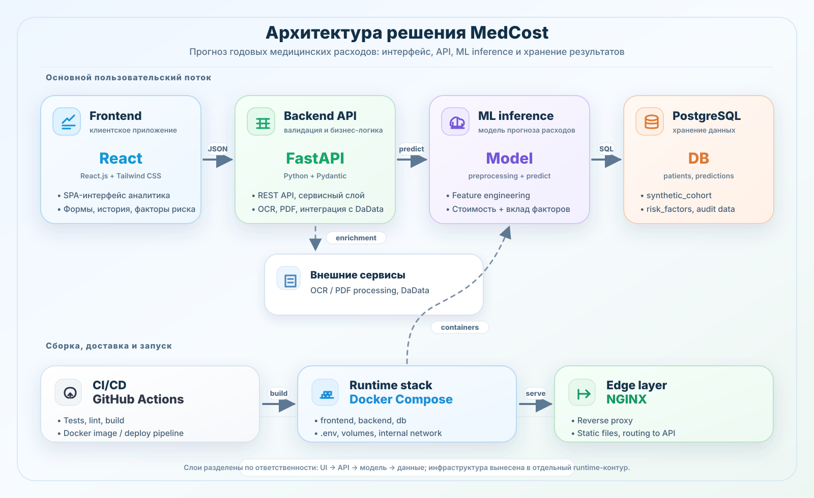

### Краткое описание компонентов системы

- **Frontend (React + Tailwind CSS)** — пользовательский интерфейс системы: формы ввода, просмотр результатов, история прогнозов, аналитические экраны и работа с OCR-сценарием.
- **nginx** — входная точка приложения, которая проксирует HTTP-запросы к frontend и backend-сервисам.
- **Backend (FastAPI)** — центральный серверный слой, который реализует REST API, валидацию входных данных, ML-инференс, интерпретацию факторов риска, PDF-генерацию, OCR-flow и интеграцию с Dadata.
- **PostgreSQL** — реляционная база данных, в которой хранятся карточки пациентов, история прогнозов, baseline-синтетическая когорта и факторы риска.
- **GitHub Actions** — CI-контур, автоматически проверяющий сборку контейнеров и прохождение тестов при изменениях в кодовой базе.

#### 1. Клиентский слой

Frontend-приложение реализовано на React и разделено на страницы:

- `/dashboard` — экран аналитики;
- `/predict` — основной сценарий расчёта;
- `/history` — история расчётов, поиск, удаление;
- `/factors` — отображение факторов риска;
- `/settings` — служебные настройки / статус.

#### 2. Серверный слой

Backend организован вокруг модулей:

- `routers/` — HTTP-эндпойнты;
- `services/` — прикладная логика (ML, OCR, Dadata, PDF);
- `models.py` — SQLAlchemy-модели;
- `schemas.py` — Pydantic-схемы;
- `database.py` — подключение к БД и сессии.

#### 3. Слой данных

Используются четыре основные таблицы:

- `patients`
- `predictions`
- `risk_factors`
- `synthetic_cohort`

Роли таблиц описаны подробно в разделе про базу данных.

### Логика взаимодействия компонентов

#### Обычный сценарий расчёта

1. Пользователь открывает frontend.
2. React-приложение отправляет запрос на backend `/api/predict`.
3. Backend валидирует payload.
4. Backend формирует feature payload для ML-модели.
5. Загруженный pipeline вычисляет `predicted_cost`.
6. Backend сохраняет расчёт в `predictions`.
7. Backend возвращает `prediction_id` и краткий результат.
8. Frontend открывает страницу/виджет деталей и при необходимости запрашивает факторы риска.

#### OCR-сценарий

1. Пользователь загружает изображение анкеты.
2. Frontend отправляет файл в `/api/ocr/patient-form`.
3. Backend распознаёт поля анкеты.
4. React подставляет распознанные значения в форму.
5. Пользователь проверяет и при необходимости исправляет поля.
6. После этого выполняется обычный прогноз через `/api/predict`.

### Чем обусловлен выбор архитектуры:

- компоненты разделены по ответственности;
- backend можно развивать независимо от frontend;
- контейнеризация делает развёртывание воспроизводимым;
- API-контракт прозрачен и типизирован;
- архитектура остаётся достаточно простой для текущей стадии продукта, но при этом допускает дальнейшее развитие;
- решение не перегружено избыточным числом микросервисов и лишней инфраструктурной сложностью.

---

## 🗃️ База данных

### Выбор БД

Для проекта выбрана **PostgreSQL**, потому что она хорошо подходит под реляционную модель данных приложения:

1. **Чёткая схема и связи**
   - у проекта есть сущности `patients`, `predictions`, `risk_factors`, `synthetic_cohort`;
   - между ними есть естественные связи `one-to-many`;
   - такая структура лучше укладывается в реляционную СУБД, чем в документоориентированную.

2. **Поддержка транзакций**
   - важно для сценариев, где нужно атомарно сохранить пациента и прогноз;
   - помогает избегать частично сохранённых данных.

3. **Удобная работа с SQLAlchemy**
   - PostgreSQL — один из самых типовых вариантов для Python + SQLAlchemy + FastAPI.

4. **Лучше, чем SQLite, для многоконтейнерного сервиса**
   - SQLite удобна для маленьких локальных скриптов, но хуже подходит для клиент-серверного сценария с отдельным backend-контейнером и отдельной БД;
   - PostgreSQL лучше соответствует целевой архитектуре проекта.

5. **Более уместна, чем NoSQL, для текущей модели**
   - в проекте нет необходимости хранить произвольные документы без схемы;
   - здесь важнее связи, индексы и предсказуемая структура данных.

#### Почему не SQLite

SQLite могла бы подойти для самой первой прототипной версии, но:

- она файловая и не даёт такой же модели серверной БД;
- хуже отражает реальную продуктовую архитектуру;
- менее удобна для расширения схемы и многопользовательских сценариев.

#### Почему не MongoDB

MongoDB имеет смысл, когда:

- структура данных плохо формализуется;
- нужен документный формат без строгих связей.

В данном проекте, наоборот, данные хорошо структурированы, а связи между сущностями прозрачны. Поэтому PostgreSQL выглядит аккуратнее и проще для объяснения.

---

### Схема таблиц

#### 1. `patients`

Таблица карточек пациентов.

Один человек хранится **один раз**.  
Используется для хранения идентификационных данных пациента.

| Поле | Тип | Описание |
|---|---|---|
| `id` | integer, PK | Внутренний идентификатор пациента |
| `full_name` | string | ФИО пациента |
| `snils` | string, unique, not null | Внешний идентификатор пациента для поиска, дедупликации и связывания расчётов |
| `phone` | string, nullable | Телефон пациента |
| `address` | text, nullable | Адрес пациента |
| `created_at` | datetime | Дата создания записи |
| `updated_at` | datetime | Дата последнего обновления |

> `snils` не используется как primary key. Внутренним ключом остаётся `id`, а `snils` — бизнес-идентификатор для поиска существующего пациента.

#### 2. `predictions`

Таблица истории расчётов.

Один расчёт = одна запись.  
Один пациент может иметь много записей в `predictions`.

| Поле | Тип | Описание |
|---|---|---|
| `id` | integer, PK | Идентификатор прогноза |
| `patient_id` | FK → `patients.id`, nullable | Ссылка на карточку пациента |
| `full_name` | string | Snapshot имени на момент расчёта |
| `age` | integer | Возраст |
| `gender` | integer | Пол (`0/1`) |
| `bmi` | float | Индекс массы тела |
| `smoker` | boolean | Курение |
| `diabetes` | boolean | Диабет |
| `hypertension` | boolean | Гипертония |
| `heart_disease` | boolean | Болезни сердца |
| `asthma` | boolean | Астма |
| `physical_activity_level` | string | Уровень физической активности |
| `daily_steps` | integer | Число шагов в день |
| `sleep_hours` | float | Продолжительность сна |
| `stress_level` | integer | Уровень стресса |
| `doctor_visits_per_year` | integer | Визитов к врачу в год |
| `hospital_admissions` | integer | Госпитализаций |
| `medication_count` | integer | Количество лекарств |
| `city_type` | string | Тип населённого пункта |
| `previous_year_cost` | float | Расходы за прошлый год |
| `predicted_cost` | float | Рассчитанный прогноз |
| `created_at` | datetime | Дата расчёта |

#### 3. `risk_factors`

Таблица факторов риска для конкретного прогноза.

| Поле | Тип | Описание |
|---|---|---|
| `id` | integer, PK | Идентификатор записи |
| `prediction_id` | FK → `predictions.id` | Ссылка на прогноз |
| `feature_name` | string | Имя признака |
| `feature_value` | string | Значение признака |
| `shap_value` | float | Вклад признака в прогноз |
| `rank` | integer | Позиция фактора в top-N |

#### 4. `synthetic_cohort`

Таблица с исходной синтетической когортой.

Используется для:
- расчёта перцентилей;
- референсной аналитики;
- статистики на дашборде.

| Поле | Тип | Описание |
|---|---|---|
| `id` | integer, PK | Идентификатор baseline-записи |
| `age` | integer, nullable | Возраст |
| `gender` | string, nullable | Пол |
| `bmi` | float, nullable | BMI |
| `smoker` | boolean, nullable | Курение |
| `diabetes` | boolean, nullable | Диабет |
| `hypertension` | boolean, nullable | Гипертония |
| `heart_disease` | boolean, nullable | Болезни сердца |
| `asthma` | boolean, nullable | Астма |
| `physical_activity_level` | string, nullable | Физическая активность |
| `daily_steps` | integer, nullable | Шаги |
| `sleep_hours` | float, nullable | Сон |
| `stress_level` | integer, nullable | Стресс |
| `doctor_visits_per_year` | integer, nullable | Визиты к врачу |
| `hospital_admissions` | integer, nullable | Госпитализации |
| `medication_count` | integer, nullable | Количество лекарств |
| `city_type` | string, nullable | Тип населённого пункта |
| `previous_year_cost` | float, nullable | Расходы за прошлый год |
| `annual_medical_cost` | float, nullable | Фактический baseline-cost |
| `created_at` | datetime | Дата загрузки записи |

---

### Связи между таблицами


#### Пример связи `patients` ↔ `predictions`

- в `patients` пациент хранится **один раз**;
- в `predictions` один и тот же пациент может иметь **несколько расчётов**;
- связь идёт через `predictions.patient_id = patients.id`.

Это позволяет:
- искать предыдущий прогноз не по имени, а по `patient_id`;
- не путать тёзок;
- хранить историю расчётов отдельно от карточки пациента.

---

## 🔌 REST API и контракт взаимодействия

### Общие принципы

- формат обмена: **JSON**
- загрузка анкеты для OCR: **multipart/form-data**
- PDF-экспорт: **binary response** (`application/pdf`)
- основной namespace: **`/api`**
- спецификация и тестирование: **Swagger / OpenAPI** на `/docs`

### Список endpoint’ов

| Метод | Endpoint | Назначение |
|---|---|---|
| `GET` | `/api/health` | Проверка доступности backend |
| `POST` | `/api/predict` | Создать новый прогноз |
| `PUT` | `/api/predictions/{prediction_id}/recalculate` | Пересчитать существующий прогноз |
| `GET` | `/api/predictions/{prediction_id}` | Получить детали прогноза |
| `GET` | `/api/predictions/{prediction_id}/factors` | Получить топ-факторы |
| `GET` | `/api/predictions/{prediction_id}/assessment` | Получить категорию риска / перцентиль / рекомендацию |
| `GET` | `/api/predictions/{prediction_id}/pdf` | Скачать PDF-отчёт |
| `GET` | `/api/history` | Получить историю прогнозов |
| `DELETE` | `/api/history/{prediction_id}` | Удалить прогноз |
| `POST` | `/api/ocr/patient-form` | Распознать поля анкеты |
| `POST` | `/api/percentile` | Рассчитать перцентиль для заданного `predicted_cost` |
| `GET` | `/api/stats/overview` | Получить агрегированную статистику для дашборда |

---

### Основные схемы запросов и ответов

#### `POST /api/predict`

Создаёт новый прогноз.

**Request body:**
```json
{
  "full_name": "Иван Иванов",
  "snils": "123-456-789 00",
  "phone": "+7-900-000-00-00",
  "address": "г. Москва",
  "age": 45,
  "gender": 1,
  "bmi": 27.5,
  "smoker": false,
  "diabetes": false,
  "hypertension": false,
  "heart_disease": false,
  "asthma": false,
  "physical_activity_level": "Medium",
  "daily_steps": 6000,
  "sleep_hours": 7.0,
  "stress_level": 4,
  "doctor_visits_per_year": 2,
  "hospital_admissions": 0,
  "medication_count": 1,
  "city_type": "Urban",
  "previous_year_cost": 12000.0
}
```

**Response:**
```json
{
  "prediction_id": 101,
  "full_name": "Иван Иванов",
  "predicted_cost": 14530.42,
  "patient_id": 5,
  "created_at": "2026-04-20T10:15:00"
}
```

#### `GET /api/predictions/{prediction_id}`

Возвращает полные детали прогноза и список факторов риска.

#### `GET /api/predictions/{prediction_id}/assessment`

Возвращает:
- перцентиль;
- категорию риска;
- текстовую рекомендацию.

#### `GET /api/history`

Поддерживает query-параметр:

- `search` — поиск по ID или ФИО;
- `limit` — ограничение количества записей.

Пример:
```text
GET /api/history?search=Иванов&limit=100
```

#### `POST /api/ocr/patient-form`

Принимает файл изображения анкеты и возвращает:

- `fields` — распознанные поля;
- `raw_text` — сырой OCR-текст;
- `warnings` — предупреждения по распознаванию и валидации.

#### `GET /api/stats/overview`

Возвращает два блока статистики:

- `synthetic` — baseline-метрики по `synthetic_cohort`;
- `predictions` — live-метрики по пользовательским прогнозам.

---

### Примеры запросов

#### Проверка healthcheck
```bash
curl http://localhost:8000/api/health
```

#### Создание прогноза
```bash
curl -X POST http://localhost:8000/api/predict \
  -H "Content-Type: application/json" \
  -d '{
    "full_name": "Иван Иванов",
    "snils": "123-456-789 00",
    "phone": "+7-900-000-00-00",
    "address": "г. Москва",
    "age": 45,
    "gender": 1,
    "bmi": 27.5,
    "smoker": false,
    "diabetes": false,
    "hypertension": false,
    "heart_disease": false,
    "asthma": false,
    "physical_activity_level": "Medium",
    "daily_steps": 6000,
    "sleep_hours": 7.0,
    "stress_level": 4,
    "doctor_visits_per_year": 2,
    "hospital_admissions": 0,
    "medication_count": 1,
    "city_type": "Urban",
    "previous_year_cost": 1200.0
  }'
```

#### Получение факторов риска
```bash
curl http://localhost:8000/api/predictions/101/factors
```

#### Получение percentile
```bash
curl -X POST http://localhost:8000/api/percentile \
  -H "Content-Type: application/json" \
  -d '{"predicted_cost": 14530.42}'
```

#### Получение OCR-результата
```bash
curl -X POST http://localhost:8000/api/ocr/patient-form \
  -F "file=@patient_form.png"
```

#### Экспорт PDF
```bash
curl http://localhost:8000/api/predictions/101/pdf --output prediction-report.pdf
```

---

## 🧠 OCR-подсистема

### Назначение

OCR-подсистема нужна для автоматического распознавания данных из анкеты пациента и автозаполнения формы расчёта на frontend.

Это снижает объём ручного ввода и делает сценарий работы ближе к реальному пользовательскому процессу: пользователь загружает изображение анкеты, backend извлекает из неё данные, а frontend подставляет распознанные значения в форму, оставляя пользователю возможность проверить и при необходимости исправить результат.

### Используемые библиотеки

- **Tesseract OCR** — движок распознавания текста;
- **pytesseract** — Python-обёртка для вызова Tesseract из backend-кода;
- **Pillow** — чтение изображения и приведение его к RGB-формату перед OCR.

### Какие поля поддерживаются

OCR-сервис распознаёт следующие поля:

- `full_name`
- `snils`
- `address`
- `phone`
- `age`
- `gender`
- `bmi`
- `smoker`
- `diabetes`
- `hypertension`
- `heart_disease`
- `asthma`
- `physical_activity_level`
- `daily_steps`
- `sleep_hours`
- `stress_level`
- `doctor_visits_per_year`
- `hospital_admissions`
- `medication_count`
- `city_type`
- `previous_year_cost`

### Как работает OCR-алгоритм

#### 1. Загрузка изображения

Backend получает файл через `multipart/form-data` и пытается открыть его как изображение.

Если файл пустой, повреждён или не может быть прочитан как изображение, API возвращает ошибку чтения изображения анкеты.

После успешной загрузки изображение приводится к RGB-формату, чтобы Tesseract OCR получил входные данные в ожидаемом виде.

#### 2. OCR текста через Tesseract

Для распознавания используется Tesseract OCR со следующими настройками:

- основной язык: `rus`;
- fallback-язык: `rus_standard`;
- OCR config: `--oem 1`.

На основном проходе Tesseract строит два результата:

- `raw_text` — полный распознанный текст анкеты через `image_to_string(...)`;
- `ocr_data` — набор распознанных текстовых фрагментов с координатами через `image_to_data(...)`.

`raw_text` используется для извлечения большинства текстовых и числовых полей.

`ocr_data` используется отдельно для обработки чекбоксов, где важно учитывать расположение слов и квадратных областей на изображении.

#### 3. Парсинг текстовых и числовых полей

После OCR backend извлекает большинство полей из `raw_text`.

Для этого используются:

- нормализация текста;
- регулярные выражения;
- отдельные функции очистки и нормализации значений;
- приведение распознанных строк к внутреннему формату backend и ML-модели.

На этом этапе координаты OCR-фрагментов не используются для большинства обычных текстовых полей. Основная логика здесь строится на анализе распознанного сплошного текста.

#### 3.1. Как извлекаются значения полей

Для каждого поля задан свой шаблон поиска по тексту анкеты.

Например, алгоритм ищет в `raw_text` строки или фрагменты, соответствующие полям:

- `Возраст`;
- `Пол`;
- `BMI`;
- `Уровень физической активности`;
- `Шагов в день`;
- `Часы сна`;
- `Уровень стресса`;
- `Визитов к врачу в год`;
- `Госпитализаций`;
- `Количество лекарств`;
- `Тип населённого пункта`;
- `Расходы за прошлый год`.

После нахождения текстового значения backend пытается привести его к нужному типу и формату.

Для ФИО используется отдельная логика:

1. алгоритм ищет строку с заголовком `ФИО пациента`;
2. затем берёт значение после двоеточия;
3. если значение не найдено в той же строке, проверяет несколько ближайших следующих строк;
4. найденная строка очищается от лишних символов, не относящихся к имени.

Для опциональных полей `address` и `phone` используется отдельный блок извлечения. Если эти поля не распознаны, они не считаются критической ошибкой.

#### 3.2. Нормализация значений

После извлечения значения приводятся к внутреннему формату:

- СНИЛС нормализуется к виду `XXX-XXX-XXX XX`;
- телефон очищается от лишних символов;
- пол преобразуется в числовой формат:
  - `женский` → `0`;
  - `мужской` → `1`;
- уровень физической активности преобразуется в категории:
  - `низкий` → `Low`;
  - `средний` → `Medium`;
  - `высокий` → `High`;
- тип населённого пункта преобразуется в категории:
  - город → `Urban`;
  - пригород → `Semi-Urban`;
  - сельский населённый пункт / деревня → `Rural`;
- целочисленные признаки приводятся к `int`;
- дробные числовые признаки приводятся к `float`.

Если значение найдено, но не может быть корректно нормализовано, backend добавляет предупреждение в `warnings`.

#### 4. Отдельная обработка чекбоксов

Для бинарных полей используется отдельный этап обработки, потому что для них недостаточно только распознанного текста.

К бинарным полям относятся:

- `smoker`
- `diabetes`
- `hypertension`
- `heart_disease`
- `asthma`

Для этих признаков backend анализирует не только текст, но и расположение элементов на изображении.

Алгоритм работает следующим образом:

1. Tesseract возвращает OCR-данные через `image_to_data(...)`.
2. Backend извлекает из них распознанные слова и координаты их bounding boxes.
3. Слова группируются в строки по OCR-метаданным.
4. На изображении ищутся квадратные области, похожие на чекбоксы.
5. Для каждого бинарного поля ищется строка с его названием, например `курение`, `диабет`, `гипертония`, `болезни сердца`, `астма`.
6. В этой строке алгоритм пытается найти чекбоксы, соответствующие вариантам `Да` и `Нет`.
7. Если подписи `Да` и `Нет` не удалось надёжно сопоставить по словам, используется fallback-логика: берутся два последних чекбокса в строке.
8. Для найденных чекбоксов анализируется внутренняя область квадрата и определяется, отмечен он или нет.
9. Если отмечен вариант `Да`, поле получает значение `true`.
10. Если отмечен вариант `Нет` или не отмечен `Да`, поле получает значение `false`.

Если в одном поле отмечены оба варианта, backend добавляет предупреждение и возвращает для этого поля `false`.

Если строка чекбокса или сами чекбоксы не найдены, backend также добавляет предупреждение.

#### 5. Fallback OCR

Если после основного текстового парсинга остаются предупреждения, сервис делает дополнительный OCR-проход с fallback-языком `rus_standard`.

Fallback-проход используется для повторного извлечения текстовых и числовых полей из распознанного текста.

Важно: fallback OCR применяется именно к текстовому распознаванию через `image_to_string(...)`. Для чекбоксов отдельный fallback `image_to_data(...)` не строится: чекбоксы обрабатываются по OCR-данным основного прохода.

После fallback-прохода backend объединяет результаты:

- значения, найденные на fallback-проходе, могут дополнить основной результат;
- значения, уже найденные на основном проходе, сохраняют приоритет;
- предупреждения по полям, которые удалось восстановить, фильтруются.

#### 6. Валидация распознанных полей

После извлечения и нормализации выполняется валидация распознанных значений.

Проверяются:

- типы данных;
- допустимые числовые диапазоны;
- допустимые категории;
- корректность бинарных значений;
- корректность значений `gender`, `physical_activity_level` и `city_type`.

Для числовых полей заданы допустимые диапазоны.

Например:

- `age`: от `18` до `100`;
- `daily_steps`: от `0` до `50000`;
- `stress_level`: от `1` до `10`;
- `doctor_visits_per_year`: от `0` до `100`;
- `hospital_admissions`: от `0` до `50`;
- `medication_count`: от `0` до `100`;
- `bmi`: от `10.0` до `60.0`;
- `sleep_hours`: от `0.0` до `24.0`;
- `previous_year_cost`: от `0.0` и выше.

Если значение не проходит проверку, оно не попадает в итоговый словарь `fields`, а в `warnings` добавляется соответствующее предупреждение.

#### 7. Ответ API

На выходе OCR API возвращает объект со следующими полями:

```json
{
  "fields": {},
  "raw_text": "",
  "warnings": []
}
```

Где:

- `fields` — словарь успешно распознанных и провалидированных значений;
- `raw_text` — полный текст, полученный на основном OCR-проходе;
- `warnings` — список предупреждений о полях, которые не удалось распознать, нормализовать или провалидировать.

Frontend использует `fields` для автозаполнения формы расчёта.

Пользователь видит подставленные значения и при необходимости может исправить их вручную перед отправкой формы.

### Схема OCR-потока

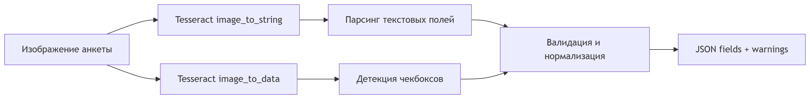

### Почему выбран Tesseract OCR

В проекте используется **Tesseract OCR** как базовый движок распознавания текста, потому что он хорошо подходит для обработки анкет фиксированного формата.

Основные причины выбора:

- **open-source и бесплатность** — Tesseract распространяется свободно и не требует оплаты за использование или зависимости от коммерческого OCR API;
- **локальный запуск** — Tesseract работает внутри backend-контейнера и не требует внешнего API;
- **простая интеграция** — его легко встроить в существующий Python/FastAPI backend;
- **доступ к координатам текста** — помимо распознанных слов можно получить bounding boxes и использовать их для привязки значений к полям анкеты;
- **прозрачный пайплайн** — Tesseract хорошо сочетается с разбором документа с учётом его структуры, координат текстовых блоков и расположения полей.;
- **предсказуемость и воспроизводимость** — для структурированной анкеты rule-based обработка поверх Tesseract даёт более контролируемый результат.

Использование LLM в качестве основного OCR-слоя не было выбрано, так как для анкеты фиксированного шаблона это было бы избыточным решением. Такой подход потребовал бы более сложной инфраструктуры, дал бы менее детерминированный результат и усложнил бы отладку. В текущей архитектуре связка **Tesseract + постобработка правилом** лучше соответствует задаче.

---

## 🧩 Интеграция с Dadata

### Назначение

В проекте подготовлен отдельный сервисный модуль `dadata_service.py`, который нужен для нормализации и обогащения идентификационных полей пациента.

Поддерживаются функции:

- `clean_full_name(...)`
- `clean_address(...)`
- `clean_phone(...)`
- `suggest_address(...)`

### Что именно делает сервис

#### 1. Нормализация ФИО
Используется endpoint Dadata Cleaner `name`, чтобы привести имя к более стандартизованному виду.

#### 2. Нормализация адреса
Используется endpoint Cleaner `address`, чтобы уменьшить вариативность адресных строк.

#### 3. Нормализация телефона
Используется endpoint Cleaner `phone`.

#### 4. Подсказки по адресу
Используется endpoint Suggestions API `suggest/address`.

### Как подключается

Dadata активируется через переменные окружения:

- `DADATA_API_KEY`
- `DADATA_API_SECRET`

Если ключи не заданы:
- backend не падает;
- сервис просто возвращает исходные значения или пустой результат.

### Какие плюсы даёт интеграция с Dadata

- **снижение количества дублей пациентов** — за счёт более точной нормализации и сопоставления персональных данных;
- **повышение качества карточек `patients`** — данные становятся более полными, единообразными и удобными для последующей обработки;
- **улучшение качества данных после OCR** — распознанные значения можно дополнительно очищать и приводить к более надёжному формату;
- **более удобный пользовательский сценарий** — адреса и другие поля можно быстрее и точнее заполнять на frontend.

---

## 📦 Контейнеризация и развёртывание

### Общая схема

Проект поднимается через **Docker Compose** и состоит из четырёх сервисов:

- `db`
- `backend`
- `frontend-react`
- `nginx`

### `docker-compose.yml`

#### `db`
- образ: `postgres:16`
- хранит все данные приложения;
- имеет `healthcheck`, чтобы backend стартовал после готовности БД.

#### `backend`
- собирается из `src/backend/Dockerfile`;
- поднимает FastAPI на порту `8000`;
- получает:
  - `DATABASE_URL`
  - `MODEL_PATH`

#### `frontend-react`
- собирается из `src/frontend-react/Dockerfile`;
- запускает Vite dev-сервер на `8501` внутри контейнера.

#### `nginx`
- проксирует:
  - `/` → `frontend-react`
  - `/api/` → `backend`
- наружу публикуется на порту `8501`.

### Схема контейнеров

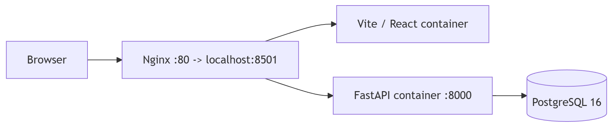

### Backend Dockerfile

Backend image:

- основан на `python:3.11-slim`;
- устанавливает `tesseract-ocr`, `tesseract-ocr-rus`, `fonts-dejavu-core`;
- обновляет русский tessdata-файл;
- ставит Python-зависимости;
- копирует backend-код и артефакт модели;
- запускает `uvicorn`.

### Frontend Dockerfile

Frontend image:

- основан на `node:20-alpine`;
- устанавливает npm-зависимости;
- копирует React/Vite-проект;
- запускает Vite dev server.

> Для production-режима React-приложение можно собирать в static build и отдавать напрямую из Nginx. В текущей версии выбран более гибкий способ: frontend работает в отдельном контейнере, а Nginx проксирует к нему запросы. Такой вариант удобен для активной разработки и дальнейшего перехода к production-контуру.

### Nginx

Конфигурация `infra/nginx/default.conf` делает две вещи:

1. проксирует `/api/*` на `backend:8000`;
2. проксирует все остальные запросы на `frontend-react:8501`.

Это позволяет использовать один внешний адрес:

```text
http://localhost:8501
```

для всего приложения.

---

## 🔐 Переменные окружения

### Backend

| Переменная | Назначение |
|---|---|
| `DATABASE_URL` | Строка подключения к PostgreSQL |
| `MODEL_PATH` | Путь к сохранённому `.joblib` pipeline |
| `DADATA_API_KEY` | Ключ доступа к Dadata Cleaner / Suggestions |
| `DADATA_API_SECRET` | Секрет Dadata |

### Frontend

| Переменная | Назначение |
|---|---|
| `VITE_API_BASE_URL` | Базовый URL backend API |

> В текущем nginx-сценарии frontend может работать и с пустым `VITE_API_BASE_URL`, используя относительные пути `/api/*`.

---


## 📈 Алгоритмы машинного обучения

Данный раздел описывает ML-исследование по прогнозированию годовых медицинских расходов пациента (`annual_medical_cost`) на основе табличных данных. Основной фокус — ноутбук `full-research.ipynb`; дополнительные ноутбуки используются как проверка выводов на более крупном и сложном датасете.

Исследование состоит из четырёх ноутбуков:

| Ноутбук | Роль |
|---|---|
| `full-research.ipynb` | Основное исследование на исходном синтетическом датасете |
| `additional-research-all-features.ipynb` | Дополнительный эксперимент на расширенном датасете с максимально широким набором признаков |
| `additional-research.ipynb` | Дополнительный эксперимент на расширенном leakage-aware наборе признаков |
| `additional-research-common-features.ipynb` | Проверка моделей на признаках, сопоставимых с исходным датасетом |

---

### 1. Бизнес-задача

Задача проекта — построить модель, которая по данным о пациенте оценивает его **ожидаемые годовые медицинские расходы**. Такой прогноз может быть полезен в страховом сценарии: для предварительной оценки медицинского риска, поддержки подбора страхового плана и анализа факторов, связанных с будущей стоимостью обслуживания.

Медицинские расходы — сложная целевая переменная. На них одновременно влияют демографические признаки, биометрические показатели, образ жизни, хронические заболевания, история обращений к врачу, госпитализации, количество лекарств и предыдущие расходы. При этом связь между признаками и расходами часто нелинейна: несколько умеренных факторов риска могут вместе приводить к заметному росту ожидаемой стоимости.

Основная ML-гипотеза состоит в том, что модели машинного обучения смогут лучше уловить структуру данных, чем простые фиксированные правила, потому что они:

- работают с большим количеством признаков;
- учитывают нелинейные зависимости;
- могут находить взаимодействия между факторами риска;
- позволяют оценивать вклад признаков в итоговый прогноз.

Поэтому в исследовании сравниваются разные классы моделей: от интерпретируемых линейных моделей до более гибких tree-based и boosting-алгоритмов.

В рамках проекта решается задача **регрессии**:

```text
X -> annual_medical_cost
```

где:

```text
X — набор признаков пациента;
annual_medical_cost — ожидаемые годовые медицинские расходы.
```

В основном исследовании исходный `annual_medical_cost` отражал расходы пациента уже с учётом страхового покрытия. Для моделирования более реалистичного страхового сценария была восстановлена полная стоимость медицинских расходов:

```text
annual_medical_cost = annual_medical_cost / (1 - insurance_coverage_pct / 100)
```

После корректировки признаки `insurance_type` и `insurance_coverage_pct` были исключены из модели, так как в целевом сценарии пациент может ещё не иметь выбранной страховки.

---

### 2. Данные

#### 2.1. Основной синтетический датасет

Основное исследование выполнено на [синтетическом датасете](https://www.kaggle.com/datasets/miadul/medical-cost-predication-dataset/data):

- наблюдений: **5 000**;
- исходных признаков: **20**;
- пропуски: отсутствуют;
- целевая переменная: `annual_medical_cost`.

Группы признаков:

| Группа | Признаки |
|---|---|
| Демография | `age`, `gender`, `bmi` |
| Образ жизни | `smoker`, `physical_activity_level`, `daily_steps`, `sleep_hours`, `stress_level` |
| Заболевания | `diabetes`, `hypertension`, `heart_disease`, `asthma` |
| Медицинская нагрузка | `doctor_visits_per_year`, `hospital_admissions`, `medication_count` |
| Локация | `city_type` |
| Исторические расходы | `previous_year_cost` |
| Target | `annual_medical_cost` |

#### 2.2. Расширенный датасет

Дополнительные исследования выполнены на [новом датасете](https://www.kaggle.com/datasets/mohankrishnathalla/medical-insurance-cost-prediction/data) с более широким набором признаков:

- наблюдений: **100 000**;
- признаков: **50+**;
- целевая переменная: `annual_medical_cost`.

В расширенном датасете используется более широкий набор признаков по сравнению с исходным синтетическим датасетом. Ниже признаки сгруппированы по смысловым категориям.

| Группа | Признаки |
|---|---|
| Демография и социально-экономика | `person_id`, `age`, `sex`, `region`, `urban_rural`, `income`, `education`, `marital_status`, `employment_status`, `household_size`, `dependents` |
| Образ жизни | `bmi`, `smoker`, `alcohol_freq` |
| Клинические показатели и риск | `systolic_bp`, `diastolic_bp`, `ldl`, `hba1c`, `risk_score`, `is_high_risk` |
| Хронические состояния | `chronic_count`, `hypertension`, `diabetes`, `asthma`, `copd`, `cardiovascular_disease`, `cancer_history`, `kidney_disease`, `liver_disease`, `arthritis`, `mental_health` |
| Медицинская нагрузка | `visits_last_year`, `hospitalizations_last_3yrs`, `days_hospitalized_last_3yrs`, `medication_count` |
| Медицинские процедуры | `proc_imaging_count`, `proc_surgery_count`, `proc_physio_count`, `proc_consult_count`, `proc_lab_count`, `had_major_procedure` |
| Policy-признаки | `plan_type`, `network_tier`, `deductible`, `copay`, `policy_term_years`, `policy_changes_last_2yrs`, `provider_quality` |
| Premium- и claims-признаки | `annual_premium`, `monthly_premium`, `claims_count`, `avg_claim_amount`, `total_claims_paid` |
| Целевая переменная | `annual_medical_cost` |

`person_id` является техническим идентификатором и не используется как признак в моделировании. `annual_medical_cost` используется как целевая переменная.

В разных версиях дополнительного исследования использовались разные наборы признаков:

- `additional-research-common-features` — только признаки, сопоставимые с исходным синтетическим датасетом;
- `additional-research` — расширенный leakage-safe набор без policy-, premium- и claims-признаков;
- `additional-research-all-features` — максимально полный набор доступных признаков, за исключением технического идентификатора и отдельных явно дублирующих признаков.

Расширенный датасет сложнее: таргет сильнее скошен вправо, связи отдельных признаков с расходами слабее, а высокая стоимость формируется небольшой группой пациентов.

---

### 3. Краткие выводы EDA

#### 3.1. Основной синтетический датасет

Основные наблюдения:

- `annual_medical_cost` имеет умеренную правостороннюю асимметрию: среднее около **19 123**, медиана около **18 538**, skew около **0.56**.
- Самые сильные связи с таргетом по `phi_k`:
  - `hospital_admissions` — около **0.82**;
  - `heart_disease` — около **0.31**;
  - `previous_year_cost` — около **0.30**;
  - `smoker` и `medication_count` — около **0.24**.
- Наиболее выраженная линейная связь с расходами у `hospital_admissions`: Pearson около **0.85**, Spearman около **0.83**.
- Категориальные медицинские признаки (`smoker`, `diabetes`, `hypertension`, `heart_disease`) визуально повышают уровень расходов.

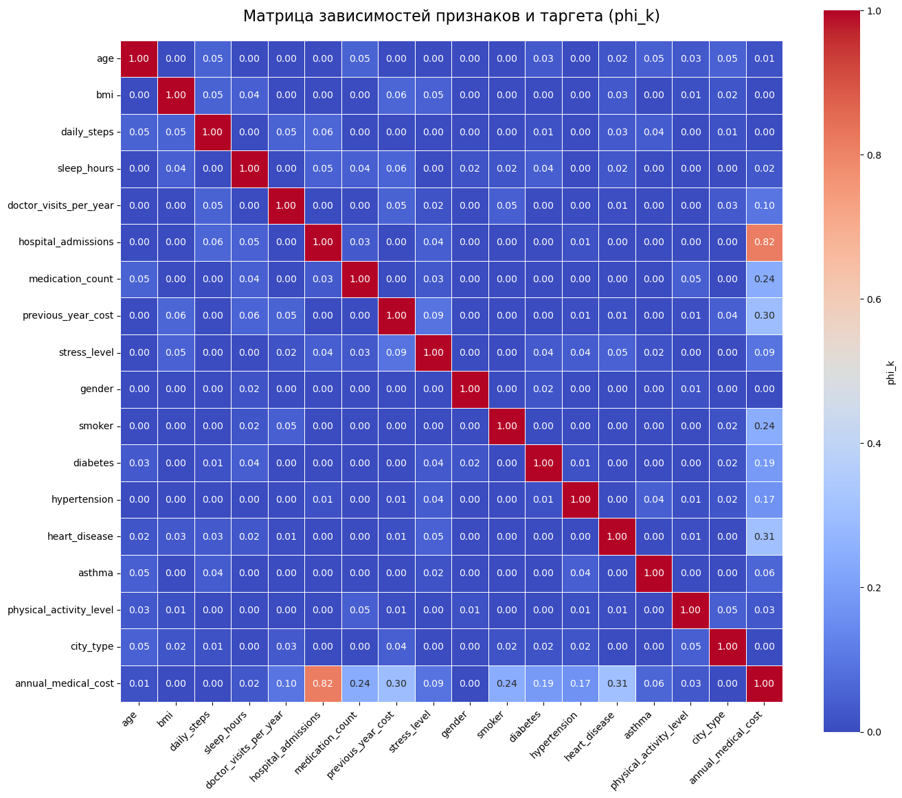

#### 3.2. Расширенные данные

В расширенном датасете EDA показал:

- `annual_medical_cost` сильно скошен вправо: основная масса пациентов имеет небольшие расходы, но есть длинный хвост дорогих случаев.
- Бинарные медицинские признаки сильно несбалансированы: положительный класс встречается редко, но часто связан с более высокими расходами.
- В leakage-aware версии наиболее заметные связи с таргетом имеют:
  - `risk_score`;
  - `days_hospitalized_last_3yrs`;
  - `chronic_count`;
  - `visits_last_year`;
  - `hospitalizations_last_3yrs`.
- В all-features версии наиболее сильные связи дают claims- и premium-признаки:
  - `annual_premium`;
  - `monthly_premium`;
  - `total_claims_paid`;
  - `avg_claim_amount`.

---

### 4. Подготовка данных и предобработка признаков

#### 4.1. Разделение данных

Во всех исследованиях использовался фиксированный train/test split:

- train: **80%**;
- test: **20%**;
- `random_state = 42`.

Для сохранения похожего распределения целевой переменной в train и test использовалась стратификация по бинам таргета (`pd.qcut`).

Test set откладывался до финального этапа. Подбор гиперпараметров, выбор модели, OOF-предсказания и веса ансамблей считались только на train на кросс-валидации.

#### 4.2. Кросс-валидация

Для промежуточной оценки качества использовалась 5-фолдовая кросс-валидация:

```text
KFold(n_splits=5, shuffle=True, random_state=42)
```

Основная метрика подбора — **MAE**.

#### 4.3. Пайплайны предобработки

В проекте сознательно используются разные пайплайны предобработки для разных семейств моделей.

#### Линейные модели

Линейные модели чувствительны к масштабу и распределению признаков, поэтому использовался отдельный пайплайн:

- числовые признаки:
  - `SimpleImputer(strategy='median')`;
  - для асимметричных признаков — `log1p`;
  - `StandardScaler`;
- бинарные признаки:
  - `SimpleImputer(strategy='most_frequent')`;
- категориальные признаки:
  - `SimpleImputer`;
  - `OneHotEncoder`;
- в части расширенных экспериментов таргет также логарифмировался через `TransformedTargetRegressor`.

Цель такой обработки — сделать признаки сопоставимыми по масштабу и улучшить устойчивость регуляризованных линейных моделей.

#### Random Forest / ExtraTrees / HistGradientBoosting

Для sklearn моделей на основе деревьев масштабирование не требуется:

- отсутствующие значения в числовых признаках заменяются медианой;
- бинарные признаки остаются как `0/1`;
- категориальные признаки кодируются через `OneHotEncoder`;
- ordinal-признаки, если есть естественный порядок, могут кодироваться через `OrdinalEncoder`.

Деревья не чувствительны к масштабу признаков, поэтому `StandardScaler` здесь не нужен.

#### CatBoost

Для CatBoost использовался отдельный пайплайн:

- числовые признаки передаются как числовые;
- бинарные признаки остаются как `0/1`;
- категориальные признаки передаются в CatBoost нативно через `cat_features`.

Это важно, потому что CatBoost умеет эффективно работать с категориальными признаками без ручного one-hot encoding.

---

### 5. Модели

В исследовании использовались несколько классов моделей.

#### Линейные модели

| Модель | Идея |
|---|---|
| `LinearRegression` | Базовая линейная регрессия без регуляризации |
| `Ridge` | Линейная модель с L2-регуляризацией; стабилизирует коэффициенты при коррелированных признаках |
| `Lasso` | Линейная модель с L1-регуляризацией; может занулять часть коэффициентов |
| `ElasticNet` | Комбинация L1 и L2; балансирует отбор признаков и устойчивость |
| `LassoSelect + Ridge` | Сначала Lasso выполняет отбор признаков; за счёт L1-регуляризации часть коэффициентов зануляется или становится очень маленькой, после чего в модель передаются только наиболее значимые признаки; затем на отобранном наборе признаков обучается `Ridge`, который более устойчиво оценивает коэффициенты за счёт L2-регуляризации |

Линейные модели полезны как интерпретируемый baseline: по коэффициентам можно понять направление влияния признаков.

#### Модели на основе деревьев и бустинговые модели

| Модель | Идея |
|---|---|
| `RandomForestRegressor` | Ансамбль независимых деревьев, обученных на bootstrap-сэмплах; хорошо снижает variance |
| `ExtraTreesRegressor` | Похож на Random Forest, но добавляет больше случайности в разбиения |
| `HistGradientBoostingRegressor` | Градиентный бустинг на гистограммных признаках; эффективен на больших табличных данных |
| `CatBoostRegressor` | Градиентный бустинг с нативной обработкой категориальных признаков |

Бустинг строит ансамбль последовательно: каждое новое дерево исправляет ошибки предыдущих. Это делает такие модели сильными для табличных данных с нелинейностями и взаимодействиями признаков.

---

### 6. Метрики

В исследовании использовались четыре основные метрики.

#### MAE

```text
MAE = mean(|y - y_pred|)
```

Главная метрика проекта. Показывает среднюю абсолютную ошибку в денежных единицах.

#### RMSE

```text
RMSE = sqrt(mean((y - y_pred)^2))
```

Сильнее штрафует крупные ошибки. Полезна, если особенно важно контролировать дорогих пациентов и большие "промахи".

#### R²

```text
R² = 1 - SS_res / SS_total
```

Показывает долю дисперсии таргета, объяснённую моделью. Чем ближе к 1, тем лучше.

#### MAPE

```text
MAPE = mean(|y - y_pred| / y)
```

Показывает среднюю относительную ошибку. Для медицинских расходов может быть нестабильной, если у части пациентов расходы близки к нулю, поэтому использовалась как дополнительная метрика.

---

### 7. Подбор гиперпараметров

#### Линейные модели

Для линейных моделей использовался `GridSearchCV`.

Подбирались:

- `alpha` для Ridge и Lasso;
- `alpha` и `l1_ratio` для ElasticNet;
- параметры отбора признаков для `LassoSelect + Ridge` (подбирались `alpha` для Lasso-selector, порог отбора признаков `threshold` в `SelectFromModel`, а также `alpha` для финальной Ridge-модели).

#### Random Forest

Для Random Forest использовался `GridSearchCV`.

Основные параметры:

- `n_estimators`;
- `max_depth`;
- `min_samples_split`;
- `min_samples_leaf`;
- `max_features`.

#### HistGradientBoostingRegressor

Для HistGradientBoosting использовалась Optuna.

Подбирались:

- `loss`;
- `learning_rate`;
- `max_leaf_nodes`;
- `max_depth`;
- `min_samples_leaf`;
- `l2_regularization`;
- `max_bins`;
- `max_features`.

Также использовалась ранняя остановка:

```text
max_iter = 5000
early_stopping = True
validation_fraction = 0.15
n_iter_no_change = 50
```

#### CatBoost

Для CatBoost также использовалась Optuna.

Подбирались:

- `depth`;
- `learning_rate`;
- `l2_leaf_reg`;
- `random_strength`;
- `bagging_temperature`;
- `border_count`.

Особое внимание уделялось ранней остановке: на каждом CV-фолде модель получала `eval_set`, состоящий только из валидационной части текущего фолда. Это важно, чтобы не допустить утечки из валидации в обучение.

---

### 8. Feature importance и отбор признаков

В основном исследовании важность признаков оценивалась несколькими способами.

#### Линейные коэффициенты

Для линейных моделей анализировались коэффициенты после этапа предобработки. Так как признаки масштабировались, абсолютное значение коэффициента можно использовать как грубую оценку важности.

Важно: в дополнительных исследованиях модель обучалась на логарифме таргета, поэтому полученные там коэффициенты показывают влияние на `log1p(annual_medical_cost)`, а не прямое изменение расходов в деньгах.

#### Нативная важность признаков

Для моделей на основе деревьев использовались встроенные оценки важности:

- `feature_importances_` для Random Forest;
- Нативная важность признаков в CatBoost.

#### Permutation importance

Permutation importance оценивает, насколько ухудшается качество модели, если перемешать значения конкретного признака. Если качество сильно падает, признак важен.

#### SHAP

SHAP использовался для более детальной интерпретации CatBoost.

SHAP показывает вклад каждого признака в конкретный прогноз. Среднее `mean(|SHAP value|)` использовалось как глобальная оценка важности.

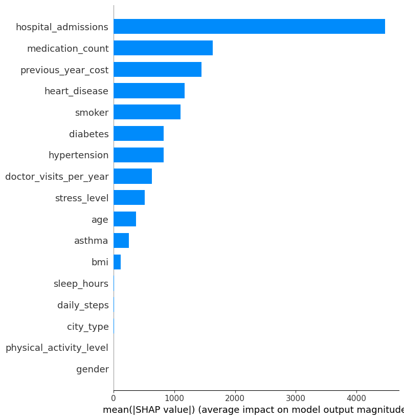

#### CatBoost на сокращённом наборе признаков

По SHAP была обучена отдельная версия CatBoost на сокращённом наборе признаков. В неё вошли признаки с заметным вкладом:

- `age`;
- `bmi`;
- `doctor_visits_per_year`;
- `hospital_admissions`;
- `medication_count`;
- `previous_year_cost`;
- `stress_level`;
- `smoker`;
- `diabetes`;
- `hypertension`;
- `heart_disease`;
- `asthma`.

Цель — проверить, можно ли упростить модель без потери качества.

---

### 9. Результаты основного исследования `full-research.ipynb`

#### 9.1. Кросс-валидация

На этапе кросс-валидации все модели оценивались на train-части данных с использованием 5-фолдовой кросс-валидации. Основной метрикой для выбора моделей была `MAE`, так как она напрямую показывает среднюю ошибку прогноза в денежных единицах.

Лучшие CV-результаты:

| Модель | CV MAE | CV RMSE | CV R² | CV MAPE |
|---|---:|---:|---:|---:|
| CatBoost SHAP-selected | **42.65** | 163.55 | 0.9992 | 0.0021 |
| CatBoost | 43.27 | **159.98** | 0.9992 | 0.0022 |
| HistGradientBoosting | 288.09 | 513.70 | 0.9944 | 0.0158 |
| Random Forest | 1021.99 | 1361.16 | 0.9612 | 0.0580 |
| ElasticNet | 1039.63 | 1452.68 | 0.9561 | 0.0542 |
| Ridge | 1043.46 | 1415.15 | 0.9584 | 0.0565 |
| Lasso | 1055.32 | 1406.55 | 0.9589 | 0.0583 |
| Linear Regression | 1058.67 | 1405.78 | 0.9589 | 0.0589 |
| LassoSelect + Ridge | 1101.17 | 1495.55 | 0.9535 | 0.0591 |

По результатам CV лучше всего показали себя две CatBoost-модели: полная версия и версия на сокращённом наборе признаков, отобранных по SHAP importance. Разница между ними небольшая: SHAP-selected версия немного лучше по `MAE`, а полная CatBoost-модель немного лучше по `RMSE`.

Линейные модели и Random Forest заметно уступают CatBoost и HistGradientBoosting, хотя всё ещё показывают высокое значение `R²`. Это связано с тем, что исходный синтетический датасет содержит достаточно сильные закономерности, но CatBoost лучше всего улавливает нелинейности и взаимодействия признаков.

#### 9.2. Финальная test-оценка

Финальная оценка проводилась на отложенной test-выборке, которая не использовалась ни при подборе гиперпараметров, ни при отборе признаков.

Оценка выполнялась не только точечно. Для каждой модели были рассчитаны основные метрики, а затем с помощью бутстрэпа (1000 итераций) по объектам тестовой выборки были построены 95% доверительные интервалы. Это позволяет оценить устойчивость качества модели, а не полагаться только на одно значение метрики.

Значения ниже представлены в формате:

```text
bootstrap mean [95% confidence interval]
```

| Модель | MAE | RMSE | R² | MAPE |
|---|---:|---:|---:|---:|
| CatBoost | **35.26 [29.85; 44.13]** | **117.64 [42.76; 215.90]** | **0.9997 [0.9991; 1.0000]** | **0.0018 [0.0017; 0.0020]** |
| CatBoost SHAP-selected | 37.09 [28.64; 49.94] | 176.75 [48.73; 330.49] | 0.9993 [0.9979; 1.0000] | 0.0018 [0.0016; 0.0021] |
| HistGradientBoosting | 286.16 [256.78; 324.12] | 591.25 [381.34; 863.46] | 0.9929 [0.9860; 0.9970] | 0.0151 [0.0141; 0.0162] |
| Random Forest | 991.31 [938.70; 1050.68] | 1334.38 [1246.41; 1437.86] | 0.9654 [0.9606; 0.9695] | 0.0569 [0.0537; 0.0604] |
| Best Linear ElasticNet | 1083.21 [1011.97; 1158.43] | 1598.57 [1421.91; 1797.68] | 0.9503 [0.9406; 0.9584] | 0.0550 [0.0524; 0.0576] |

Дополнительно было выполнено попарное бутстрэп-сравнение по `MAE` относительно лучшей модели на test — `CatBoostRegressor`.

| Модель | Сравнение с | Разница MAE | 95% CI |
|---|---|---:|---:|
| CatBoost SHAP-selected | CatBoost | 1.82 | [-2.87; 7.15] |
| HistGradientBoosting | CatBoost | 250.89 | [225.97; 282.90] |
| Random Forest | CatBoost | 956.04 | [903.74; 1013.85] |
| Best Linear ElasticNet | CatBoost | 1047.94 | [979.15; 1120.15] |

Главный вывод: полная CatBoost-модель и CatBoost SHAP-selected (с сокращённым набором признаков) показывают практически одинаковое качество по `MAE`. Доверительный интервал разницы между ними включает 0, поэтому статистически значимого отличия по MAE не выявлено.

С учётом сопоставимого качества и меньшего числа признаков, CatBoost SHAP-selected можно рассматривать как более компактную и интерпретируемую версию финальной модели. При этом полная CatBoost-модель остаётся лучшей по `RMSE`.

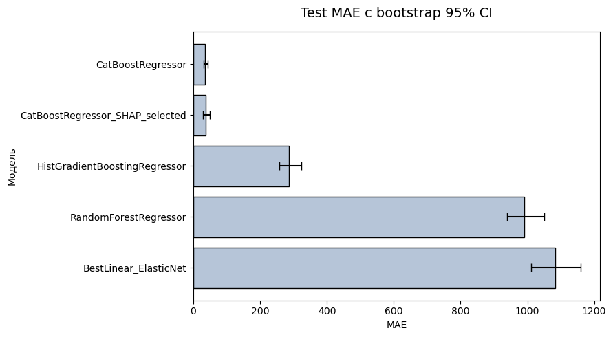

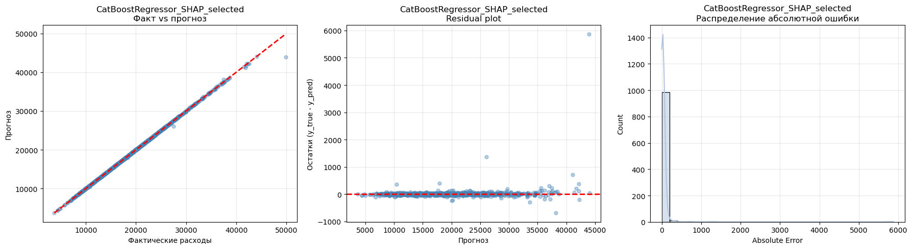

#### 9.3. Почему в основном исследовании не использовались ансамбли

На основном синтетическом датасете CatBoost фактически решил задачу почти идеально. MAE около 35 при среднем таргете около 19 000 выглядит очень сильным результатом.

Поэтому ансамблирование в этой версии не рассматривалось как основной путь: дополнительный ансамбль усложнил бы пайплайн, но вряд ли дал бы содержательный выигрыш.

Важно: качество на этом датасете оптимистично, потому что данные синтетические и относительно простые. Поэтому далее была проведена проверка на расширенном датасете.

---

### 10. Дополнительное исследование `additional-research-all-features.ipynb`

#### 10.1. Цель

Цель all-features эксперимента — проверить модели на более крупном датасете с 100 000 пациентов и существенно более широким набором признаков.

В этом исследовании используются демографические, социально-экономические, клинические, поведенческие признаки, признаки медицинской нагрузки, процедуры, policy- и claims-признаки.

В рабочей логике такой эксперимент интерпретируется как upper-bound сценарий: он показывает, какого качества можно достичь при использовании максимально богатого описания пациента. Claims- и premium-признаки особенно информативны, но требуют аккуратной интерпретации.

#### 10.2. Базовые модели

В all-features версии использовались:

- лучшая линейная модель (`Lasso`);
- `RandomForestRegressor`;
- `ExtraTreesRegressor`;
- `HistGradientBoostingRegressor`;
- `CatBoostRegressor`.

Все модели обучались на одном train/test split, а test использовался только для финальной оценки.

#### 10.3. Ансамбли моделей

В этом эксперименте проверялась гипотеза: даст ли объединение нескольких моделей выигрыш относительно лучшей одиночной модели.

Для этого сначала строились **out-of-fold предсказания** на train:

```text
каждый объект train получает прогноз от модели, которая не видела этот объект при обучении
```

OOF-прогнозы использовались для:

- оценки качества базовых моделей;
- выбора лучшей одиночной модели;
- расчёта весов ансамблей;
- обучения мета-модели в стекинге.

Тестовая выборка при расчёте весов не использовалась.

#### Simple Average Ensemble

Самый простой ансамбль:

```text
prediction = mean(prediction_1, ..., prediction_K)
```

Все модели получают одинаковый вес.

Плюс: простой и устойчивый baseline.  
Минус: слабые модели получают такой же вес, как сильные.

#### Inverse-Error Weighted Ensemble

Вес модели обратно пропорционален её OOF-ошибке, т.е.:

```text
меньше OOF-ошибка → больше вес модели в ансамбле
```

Сначала для каждой модели считаем обратную ошибку:

```text
raw_weight_i = 1 / error_i
```

где `error_i` — OOF-ошибка модели, например `MAE`.

Затем нормируем веса так, чтобы их сумма была равна 1:

```text
weight_i = raw_weight_i / sum(raw_weight_all_models)
```

Например, если одна модель ошибается меньше остальных, её `raw_weight` будет больше, а значит и итоговый вес в ансамбле будет выше.

В коде также используется небольшой `eps`, чтобы избежать деления на ноль, и параметр `power`, который управляет жёсткостью весов:

```text
raw_weight_i = 1 / (error_i + eps) ** power
```

Если `power = 1`, веса считаются обычным способом.

Если `power > 1`, слабые модели штрафуются сильнее.

Если `power < 1`, веса становятся более равномерными.

#### Pseudo-BMA (Bayesian Model Averaging)

Pseudo-BMA — байесовски-мотивированное усреднение моделей.

В строгом `Bayesian Model Averaging` нужно задавать полноценную вероятностную модель, априорные распределения (`prior`) для параметров и самих моделей, а затем считать предельное правдоподобие (`marginal likelihood`).

Иными словами:

- `prior` — это начальное предположение о том, насколько вероятна модель или значения её параметров до просмотра данных;
- `likelihood` — это то, насколько хорошо модель объясняет наблюдаемые данные;
- `marginal likelihood` — это итоговая оценка качества модели с учётом всех возможных значений её параметров.

Для моделей вроде `CatBoost`, `Random Forest` и `HistGradientBoostingRegressor` напрямую посчитать `marginal likelihood` сложно, потому что это не классические байесовские вероятностные модели, а алгоритмы, которые в первую очередь дают точечные прогнозы.

Поэтому в проекте используется практическое приближение: качество модели оценивается через out-of-fold ошибку (`OOF-ошибку`). Чем меньше OOF-ошибка, тем выше доверие к модели и тем больший вес она получает в pseudo-BMA ансамбле:

```text
prior weights → pseudo-likelihood по OOF-качеству → posterior-like weights
```

В проекте использовалась формула:

```text
log_likelihood_i = -0.5 * n * log(MSE_i + eps)
```

Равный prior для `K` моделей:

```text
P(M_i) = 1 / K
log_prior_i = -log(K)
```

Затем веса считаются через softmax:

```text
w_i = softmax(log_prior_i + log_likelihood_i / temperature)
```

#### Strict pseudo-BMA

В strict-версии:

```text
temperature = 1
```

Если одна модель лучше по MSE/RMSE, её преимущество усиливается на большом числе наблюдений. Поэтому веса могут "схлопнуться в одну модель.

Это ожидаемое поведение, а не ошибка.

#### Tempered pseudo-BMA

В tempered-версии используется большая temperature, например близкая к числу наблюдений:

```text
temperature = n
```

Это смягчает веса:

- сильные модели всё ещё получают больший вес;
- слабые модели не обнуляются полностью;
- ансамбль остаётся более распределённым.

#### Стекинг с Ridge-регрессией в качестве мета-модели

Стекинг строится следующим образом:

1. Базовые модели дают OOF-прогнозы;
2. Эти прогнозы становятся признаками для мета-модели;
3. Мета-модель обучается предсказывать `y_train`;
4. На тесте получаем прогнозы базовых моделей, затем применяем мета-модель.

В качестве мета-модели используется `Ridge`-регрессия, потому что она:

- простая;
- устойчивая;
- хорошо работает с коррелированными прогнозами;
- интерпретируема.

#### 10.4. Результаты all-features эксперимента

Финальные метрики на тесте с 95% доверительными интервалами, посчитанными через бутстрэп:

| Модель | MAE | RMSE | R² | MAPE |
|---|---:|---:|---:|---:|
| HistGradientBoosting | 922.3163 [898.8607; 946.0279] | 1870.2138 [1758.4014; 1995.1415] | 0.6305 [0.5989; 0.6602] | 0.3976 [0.3886; 0.4066] |
| Inverse-MAE Ensemble | 941.6170 [920.3699; 963.7813] | 1788.7334 [1685.4449; 1910.5479] | 0.6620 [0.6297; 0.6912] | 0.4763 [0.4652; 0.4878] |
| Tempered pseudo-BMA | 942.5632 [921.3391; 964.7130] | 1786.8958 [1683.4046; 1908.7776] | 0.6627 [0.6303; 0.6920] | 0.4786 [0.4674; 0.4903] |
| Simple Average | 944.7929 [923.5948; 967.0521] | 1798.4914 [1695.7615; 1919.9604] | 0.6583 [0.6261; 0.6874] | 0.4757 [0.4647; 0.4873] |
| ExtraTrees | 968.5187 [947.5694; 989.6288] | 1753.8019 [1653.1874; 1870.7874] | 0.6750 [0.6439; 0.7040] | 0.5227 [0.5096; 0.5357] |
| Stacking Ridge | 968.8035 [948.5503; 990.2147] | 1750.1748 [1655.5189; 1868.4229] | 0.6763 [0.6452; 0.7060] | 0.5217 [0.5085; 0.5351] |
| Random Forest | 968.8993 [948.4722; 990.5416] | 1749.9930 [1654.0317; 1869.7095] | 0.6764 [0.6445; 0.7059] | 0.5262 [0.5131; 0.5393] |
| Strict pseudo-BMA | 968.8993 [948.4722; 990.5416] | 1749.9930 [1654.0317; 1869.7095] | 0.6764 [0.6445; 0.7059] | 0.5262 [0.5131; 0.5393] |
| CatBoost | 970.7137 [950.1367; 992.1131] | 1771.5367 [1673.5285; 1888.6354] | 0.6684 [0.6374; 0.6969] | 0.5243 [0.5118; 0.5372] |
| BestLinear Lasso | 1247.2992 [1221.1807; 1274.6771] | 2316.3234 [2205.2872; 2440.5431] | 0.4334 [0.4033; 0.4625] | 0.5103 [0.5012; 0.5193] |

Главный вывод:

- по **MAE** лучшей моделью стал `HistGradientBoostingRegressor`;
- ансамбли не улучшили MAE относительно лучшей одиночной модели;
- `RandomForestRegressor`, `StackingRidge` и `ExtraTreesRegressor` лучше выглядят по RMSE/R², то есть лучше контролируют крупные ошибки;
- `StrictPseudoBMA` схлопнулся в `RandomForestRegressor`, так как pseudo-likelihood через MSE/RMSE отдал почти весь вес модели с лучшим RMSE/R².

Попарное сравнение через бутстрэп по MAE показало, что все модели и ансамбли хуже `HistGradientBoostingRegressor`: доверительные интервалы для разницы MAE полностью положительные.

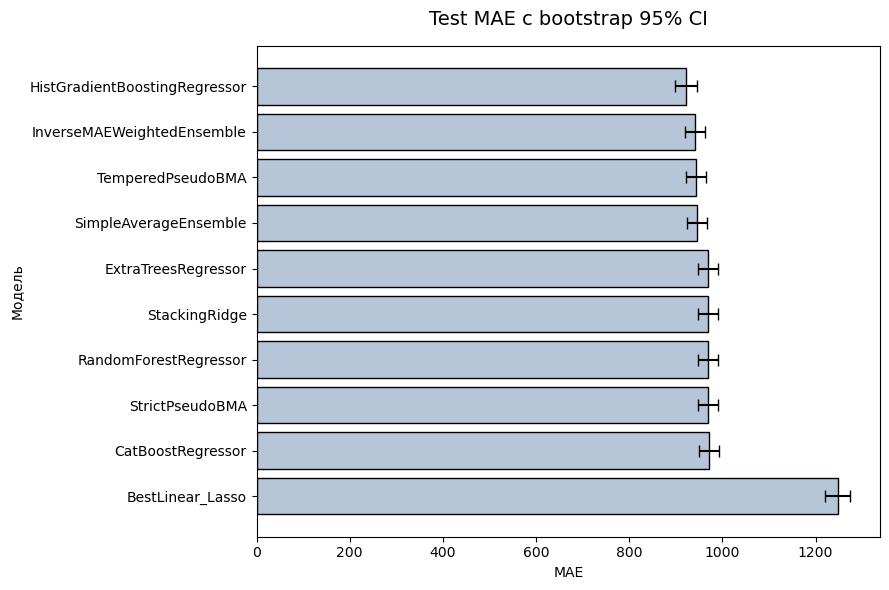

---

### 11. Остальные дополнительные эксперименты

#### 11.1. `additional-research.ipynb`

Этот ноутбук использует расширенный датасет, но в более строгой постановке: без части признаков, которые напрямую связаны с премиями и выплатами или условиями страхового плана.

Итоговые результаты:

| Модель | MAE | RMSE | R² | MAPE |
|---|---:|---:|---:|---:|
| HistGradientBoosting | **1641.83** | 2911.34 | 0.1049 | **0.7276** |
| BestLinear Lasso | 1649.47 | 2915.29 | 0.1025 | 0.7318 |
| Inverse-MAE Ensemble | 1683.52 | 2815.19 | 0.1631 | 0.8877 |
| Simple Average | 1685.78 | 2813.74 | 0.1639 | 0.8926 |
| Tempered pseudo-BMA | 1687.08 | 2812.95 | 0.1644 | 0.8953 |
| CatBoost | 1758.29 | 2799.96 | 0.1721 | 1.0146 |
| Random Forest | 1761.26 | **2798.88** | **0.1727** | 1.0198 |

Вывод: без сильных предикторов задача становится заметно сложнее. По MAE снова выигрывает `HistGradientBoostingRegressor`, а модели на основе деревьев лучше контролируют RMSE/R².

#### 11.2. `additional-research-common-features.ipynb`

В этом ноутбуке использовались только признаки, сопоставимые с исходным синтетическим датасетом. Цель — проверить, можно ли перенести выводы основного исследования на крупный датасет при максимально похожем наборе признаков.

Итоговые результаты:

| Модель | MAE | RMSE | R² | MAPE |
|---|---:|---:|---:|---:|
| HistGradientBoosting | **1679.98** | 2975.33 | 0.0651 | **0.7562** |
| BestLinear ElasticNet | 1686.87 | 2978.70 | 0.0630 | 0.7605 |
| Inverse-MAE Ensemble | 1724.62 | 2877.81 | 0.1254 | 0.9350 |
| Simple Average | 1727.15 | 2876.22 | 0.1264 | 0.9408 |
| CatBoost | 1803.42 | **2857.43** | **0.1377** | 1.0706 |

Вывод: качество слабее, потому что из модели удалено много полезных предикторов. Такой эксперимент полезен как методологическая проверка, но не как финальный практический вариант.

---

### 12. Почему бустинг-модели хорошо подходят для задачи медицинских расходов

Во всех версиях исследования модели на основе деревьев и бустинга оказались сильнее или конкурентоспособнее линейных моделей.

Это ожидаемо для медицинских расходов, потому что:

- зависимости между признаками и расходами нелинейны;
- есть сильные взаимодействия признаков;
- таргет асимметричен и содержит длинный хвост дорогих случаев;
- категориальные и бинарные признаки несбалансированы;
- отдельные редкие события могут резко увеличивать расходы.

Градиентный бустинг хорошо подходит для таких табличных данных, потому что последовательно исправляет ошибки предыдущих деревьев и умеет моделировать сложные взаимодействия.

Похожие выводы встречаются в аналогичных исследованиях:

- Orji & Ukwandu сравнивали XGBoost, GBM и Random Forest для прогнозирования стоимости медицинской страховки и показали сильные результаты ансамблевых методов на основе деревьев: https://arxiv.org/abs/2311.14139
- В исследовании для определения пациентов с высокими медицинскими расходами использовались Random Forest, Gradient Boosting Machine, ANN и логистическая регрессия для прогноза таких пациентов на основе данных о страховании: https://pmc.ncbi.nlm.nih.gov/articles/PMC9847900/
- В работе по прогнозированию размера страховых выплат также рассматриваются XGBoost, Random Forest и линейная регрессия как основные регрессионные подходы: https://www.atlantis-press.com/article/126020623.pdf

---

### 13. Мониторинг дрейфа данных: PSI 

Для продакшн-сценария важно не только обучить модель, но и отслеживать, не изменилось ли распределение входных данных относительно датасета, на котором обучалась модель. Для этого можно использовать метрику **Population Stability Index (PSI)**.

PSI сравнивает распределение признака в исходной выборке и новой выборке:

```text
PSI = sum_i (p_i - q_i) * ln(p_i / q_i)
```

где:

- `p_i` — доля объектов в бине или категории на бейслайне;
- `q_i` — доля объектов в том же бине или категории на новой выборке.

Для числовых признаков значения обычно бьются на бины. Для категориальных — сравниваются категории.

Типовые эвристики:

| PSI | Интерпретация |
|---:|---|
| `< 0.10` | распределение стабильно |
| `0.10–0.25` | умеренный drift |
| `> 0.25` | сильный drift, нужно расследование |

Эти границы не являются строгим математическим правилом, но часто используются как практический ориентир для мониторинга данных.

Для PSI используются признаки, которые применялись в основном ML-моделировании на синтетическом датасете:

- числовые признаки: `age`, `bmi`, `daily_steps`, `sleep_hours`, `doctor_visits_per_year`, `hospital_admissions`, `medication_count`, `previous_year_cost`, `stress_level`;
- бинарные признаки: `gender`, `smoker`, `diabetes`, `hypertension`, `heart_disease`, `asthma`;
- категориальные признаки: `physical_activity_level`, `city_type`.

Бинарные признаки при расчёте PSI рассматриваются как категориальные, так как для них важно сравнивать доли классов `0` и `1`.

Для числовых признаков:

1. По train-выборке строятся интервалы, например по квантилям.
2. Для каждого интервала считается доля объектов в train и test.
3. Затем сравниваются доли в соответствующих интервалах.

Для категориальных признаков:

1. Берутся все категории, встречающиеся в train или test.
2. Для каждой категории считается доля объектов в train и test.
3. Затем сравниваются распределения категорий.

Общая идея:

```text
если распределения train и test похожи → PSI близок к 0
если распределения заметно отличаются → PSI растёт
```

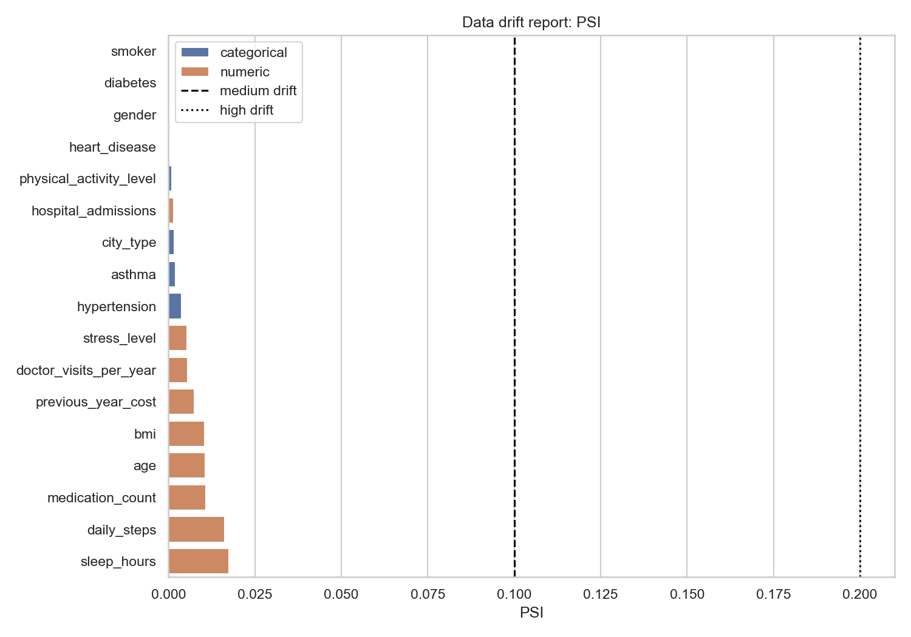

Если PSI по важному признаку становится высоким, это может означать:

- изменение состава пациентов;
- изменение источника данных;
- изменение правил заполнения признака;
- сдвиг в поведении пользователей или медицинском процессе;
- потенциальное ухудшение качества модели.

В этом случае стоит дополнительно проверить качество модели на новых данных и при необходимости обучить модель заново на новых данных.

---

### 14. Итоговые рекомендации

1. **Для синтетического основного датасета** лучшая модель — `CatBoostRegressor`. Версия `CatBoostRegressor_SHAP_selected` почти не уступает полной модели и выглядит предпочтительной, если важна компактность.

2. **Для более реалистичного расширенного датасета** лучшей моделью по MAE оказался `HistGradientBoostingRegressor`. Он даёт лучший баланс качества, скорости и простоты реализации.

3. **Если важнее контролировать крупные ошибки**, дополнительно стоит смотреть на `RandomForestRegressor` или `ExtraTreesRegressor`, так как они часто дают лучший RMSE/R².

4. **Ансамбли были проверены корректно через OOF-предсказания**, но по MAE не улучшили лучшую одиночную модель. Это важный результат: гипотеза про ансамбли была проверена, но в этой задаче лучшая одиночная модель оказалась сильнее.

5. **Для практического ML-пайплайна** рекомендуется:
   - фиксировать тестовую выборку один раз;
   - использовать разные методы предобработки для линейных моделей, деревьев и бустингов;
   - подбирать гиперпараметры только на обучающей выборке через кросс-валидации;
   - рассчитывать OOF-прогнозы для ансамблей;
   - использовать бутстрэп с доверительными интервалами и попарные сравнения для финальной оценки;
   - мониторить дрейф данных в продакшн через PSI.

6. **Для интерпретации** стоит использовать SHAP и permutation importance: они помогают понять, какие признаки действительно влияют на прогноз, и позволяют строить версии моделей с сокрашённым набором признаков.

---


## 🖼️ Основной функционал и пользовательские сценарии

1. Основной процесс расчета прогноза

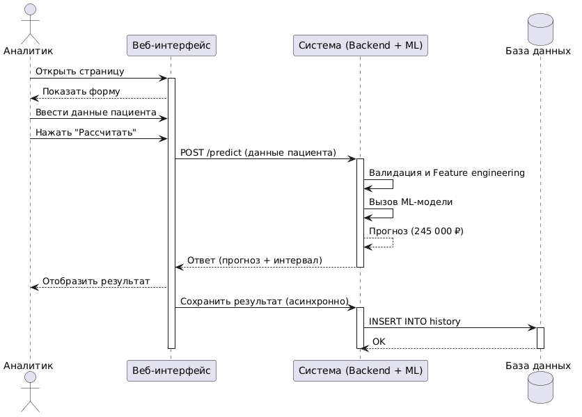

2. Получение факторов риска

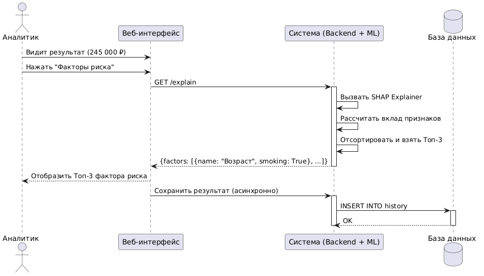

3. История и поиск

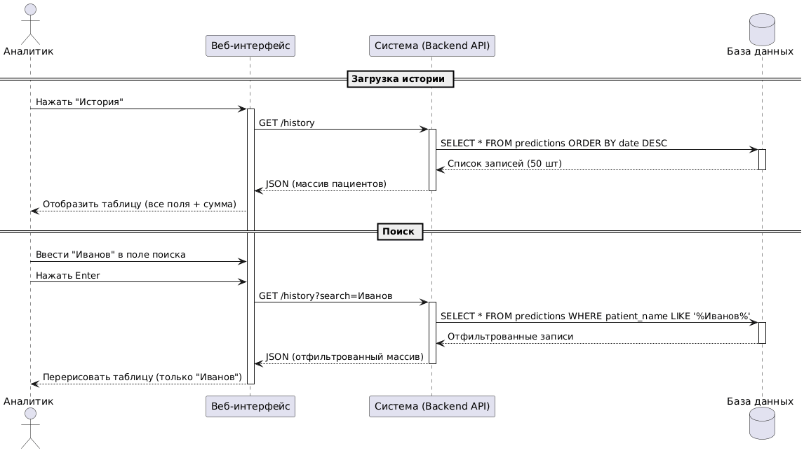

4. Формирование отчёта в виде PDF-файла

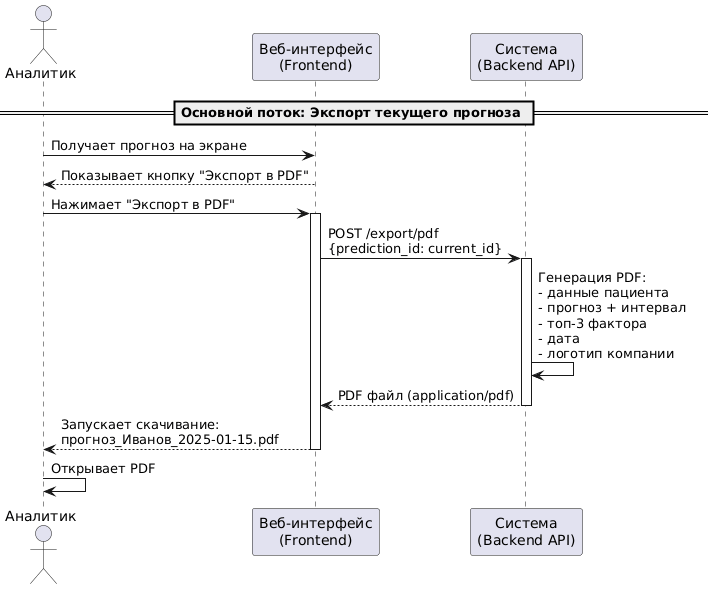

5. Удаление прогноза из истории

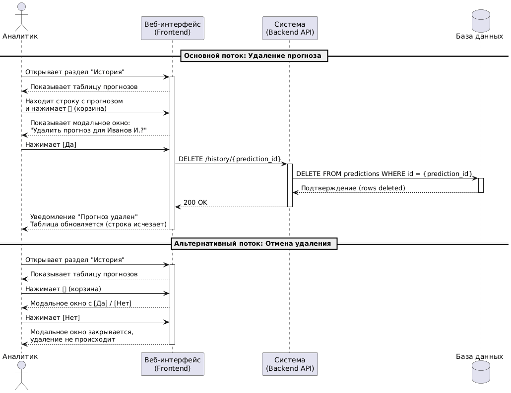

6. Сортировка в истории

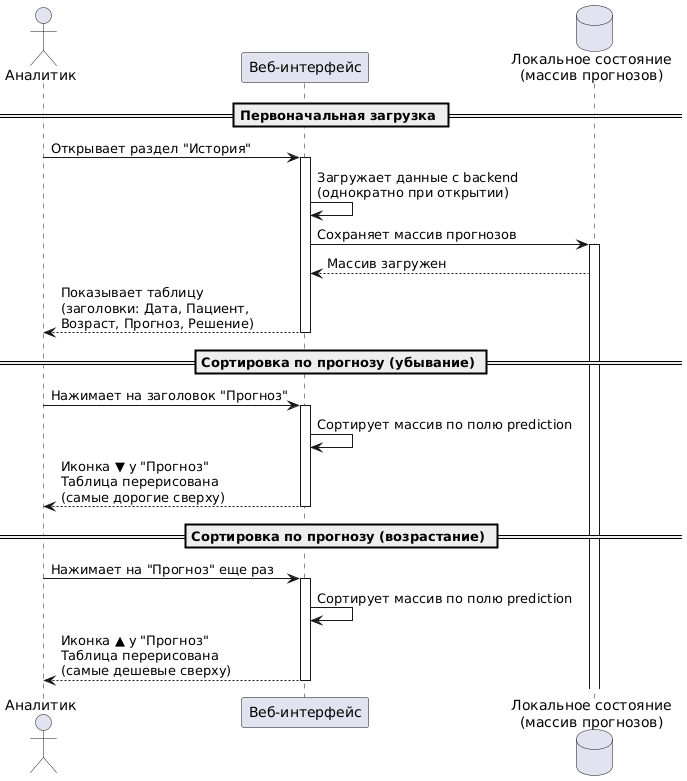